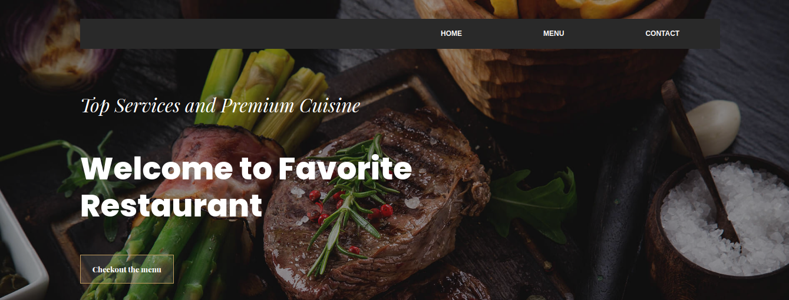
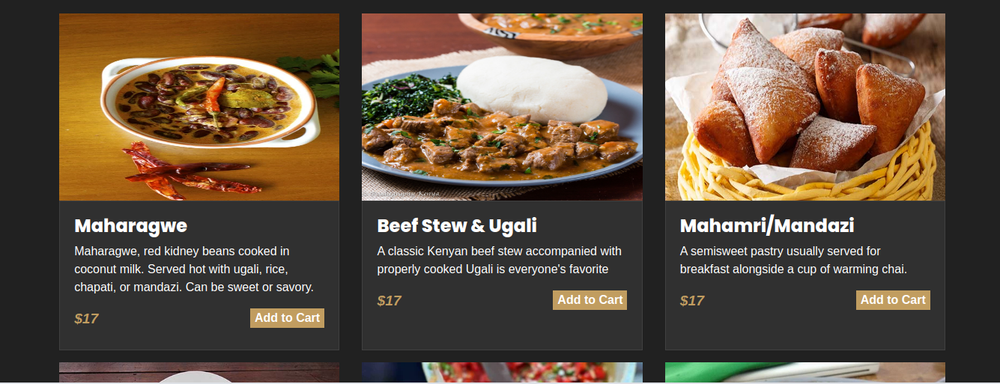

## Restaurant Page
This is a project from [the Odin project](https://www.theodinproject.com/courses/javascript/lessons/restaurant-page) for implementation of webpack and continued DOM manipulation in Javascript

## Web App Screenshots

## Built With

- Javascript
- Html
- CSS
- Webpack

## Live Demo

Click [here]() to visit a live version of the web app.

## Getting Started

To get a local copy up and running follow these simple example steps.

### Prerequisites

- npm
- webpack

### Setup
- Clone the repository.
- Run `npx webpack` from the terminal
- Run Live Server from the index.html in the dist folder

## Authors

👤 **Phylis Chepchumba**

- Github: [Phylis05](https://github.com/phlylis05)
- Linkedin: [PhylisChepchumba](https://linkedin.com/PhylisChepchumba)
- Twitter: [phylis_chumbaa](https://twitter.com/phylis_chumbaa)

## 🤝 Contributing

Contributions, issues and feature requests are welcome!

Feel free to check the [issues page](https://github.com/Phylis05/restaurant-page-JS/issues).

## Show your support

Kindly give this repository a ⭐️ if you like this project!

## Acknowledgments

- Project specifications by [Microverse](https://www.microverse.org) and [The Odin Project](https://www.theodinproject.com/courses/javascript/lessons/restaurant-page).

## 📝 License

This project is licensed under the MIT License.
